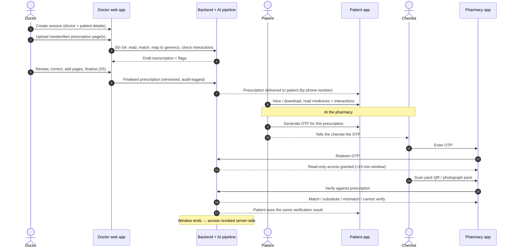
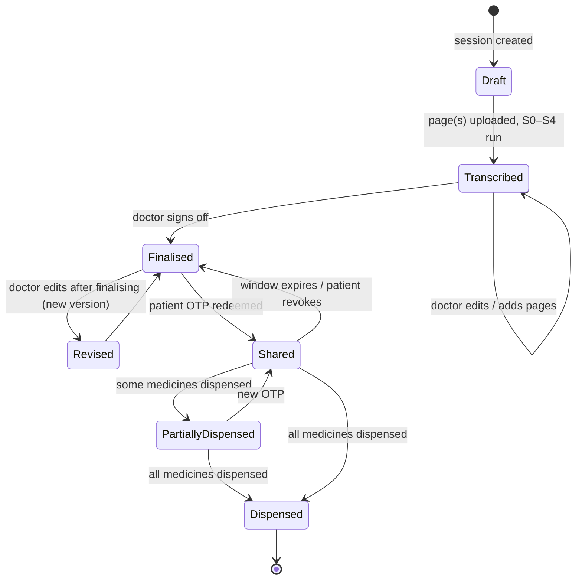
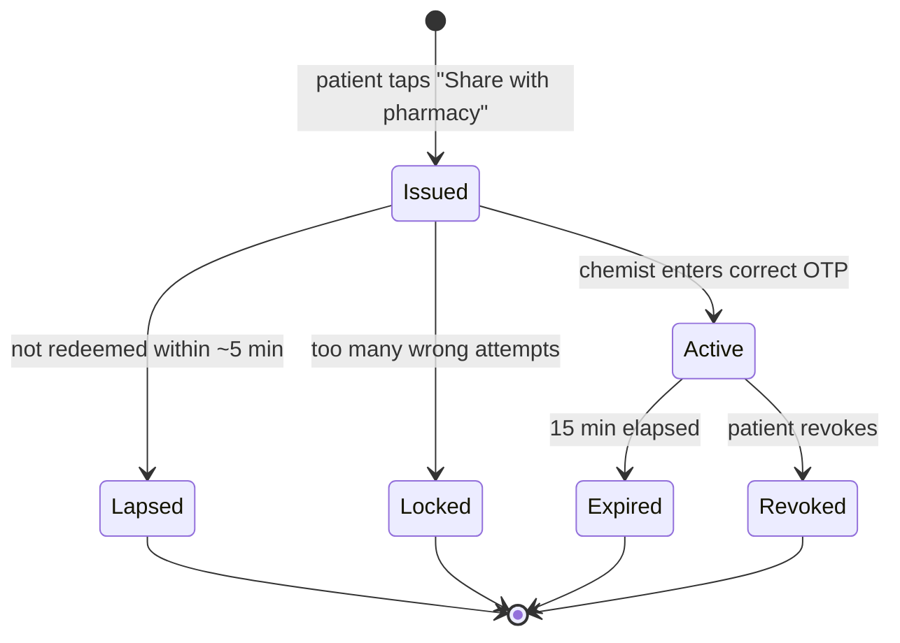

# PrescriptAI: Product Workflow

**Status:** Target workflow, agreed in principle. **Not yet implemented** beyond the
parts marked ✅ in [§9](#9-what-exists-today-vs-what-is-new).
**Companion docs:** [`README.md`](README.md) (how the system works today) ·
[`docs/ARCHITECTURE_V2.md`](docs/ARCHITECTURE_V2.md) (pipeline design) ·
[`claude.md`](claude.md) (implementation journal)

---

## 1. Summary

PrescriptAI follows a prescription from the doctor's pen to the pharmacy counter:

1. A **doctor** opens a consultation session, uploads the handwritten prescription,
   reviews the AI transcription, corrects it, and finalises it.
2. The **patient** receives a readable digital copy that explains their medicines and
   any interaction risks.
3. At the **pharmacy**, the patient shares the prescription by giving the chemist a
   one-time code (OTP). The chemist gets **temporary, read-only** access.
4. Each medicine handed over is **verified** against the prescription by scanning its
   pack QR code or photographing the pack.
5. **About 15 minutes** after the OTP is used, the chemist's access **expires
   automatically**.

The patient owns the prescription. The doctor is responsible for its content. The
chemist only ever borrows it for a short time.

---

## 2. Actors and applications

| Actor | Application | Can do |
|---|---|---|
| **Doctor** | Doctor web app (today's `web_app/`) | Create sessions, upload pages, review and correct the transcription, finalise |
| **Patient** | Patient app (mobile-first web or native) | View and download their prescriptions, read medicine and interaction info, issue OTPs, verify dispensed medicines, revoke access |
| **Chemist** | Pharmacy app (today's `pharmacy_dashboard/`, to be rebuilt) | Redeem an OTP, view the prescription during the access window, verify packs, record what was dispensed |
| **System** | Backend API + AI pipeline (S0–S5) | Transcription, vocabulary matching, interaction check, OTP issuing and expiry, audit log |

---

## 3. End-to-end flow

---

## 4. Stage-by-stage

### Stage 1: Doctor creates a consultation session

A **session** is one consultation: one doctor, one patient, one prescription (which
can span several pages).

| Field | Required | Notes |
|---|---|---|
| Doctor name | ✅ | From the doctor's profile; not retyped every session |
| Doctor address (clinic) | ✅ | From profile; a doctor may have several clinics, so pick one per session |
| Doctor speciality | ✅ | From profile |
| Doctor registration number | Recommended | State Medical Council / NMC number. Pharmacies check this before dispensing. See [§10](#10-open-questions). |
| Patient name | ✅ | |
| Patient phone number | ✅ | This is the patient's identity and how the prescription reaches them. Verify it with a one-time SMS when the patient first claims the prescription. |
| Prescription page(s) | ✅ | Uploaded in Stage 2 |

**Design notes**
- Doctor details belong to a **doctor profile** that is set up once. A session only
  references it, so details stay consistent and the doctor isn't retyping them.
- The patient record is keyed by **phone number**. The same patient seeing a second
  doctor later sees both prescriptions in one place.

### Stage 2: Upload and transcription

The doctor photographs or scans the handwritten prescription and uploads it. The
existing pipeline runs on each page:

| Step | What happens | Already built |
|---|---|---|
| S0 | Normalise the image (rotate, resize) | ✅ |
| S1 | VLM reads the whole page verbatim, with per-line confidence | ✅ |
| S2 | Match each medicine against 239k Indian brands → `confirmed` / `probable` / `ambiguous` / `unmatched` / `illegible` | ✅ |
| S3 | Brand → ingredients; each ingredient checked against NLEM 2022 | ✅ |
| S4 | Interaction check over verified ingredients, with citations; exclusions listed in `skipped` | ✅ |

**"Upload more"**: a prescription can run over several pages, or the doctor may add a
page after the first upload. All pages attach to the **same session**. The interaction
check then runs across **every medicine on every page**, not page by page, because an
interaction between a page-1 drug and a page-2 drug is still an interaction.

### Stage 3: Doctor review and finalisation

The doctor sees the page image beside the transcription (the existing Review screen).
They can:

- **Correct** any field: medicine, dosage, frequency, duration, instructions
- **Resolve** `ambiguous` medicines by picking from the candidates
- **Fill in** anything `illegible` or missed
- **Add** pages or medicines
- **Finalise**, which signs the prescription off

**Rules that carry over from the current design**
- Every correction is logged with before/after values. That log is the clinical audit
  trail and the future training data.
- A finalised prescription is **immutable**. A later edit creates **version 2**, and the
  patient and pharmacy always see the latest finalised version, labelled as revised.
- **Nothing reaches the patient until the doctor finalises.** A draft is never shared.

### Stage 4: Patient receives and understands the prescription

Once finalised, the prescription appears in the patient app under their phone number.

The patient can see:

| Section | Content | Source |
|---|---|---|
| **Prescription** | Doctor details, date, the doctor's finalised medicines with dosage / frequency / duration / instructions | Finalised session |
| **Diagnosis** | The diagnosis or complaint, if the doctor wrote one | ⚠️ Not extracted today. See [§9](#9-what-exists-today-vs-what-is-new). |
| **Medicines explained** | For each medicine: what it contains (generic ingredients), what it's commonly used for, how to take it | S3 composition + a patient-information source (new) |
| **Interactions** | Any interactions between the prescribed medicines, with severity and plain-language advice, plus which medicines could **not** be checked and why | S4 result, including `skipped` |
| **Original** | The original handwritten page image | Upload |

The patient can **download** the prescription as a PDF containing the doctor details,
the medicines, the original image, a verification QR/ID, and the AI disclaimer.

**Wording matters here.** Patients will read this without a clinician beside them, so:
- Interaction warnings say "discuss with your doctor or pharmacist". They never say
  "stop taking".
- "No interactions found" always comes with the list of what was **not** checked.
- The page states that the transcription was AI-generated and reviewed by the doctor.

### Stage 5: Sharing with the pharmacy by OTP

At the pharmacy counter:

1. The patient opens the prescription in the patient app and taps **Share with pharmacy**.
2. The app shows a **6-digit OTP** for that prescription.
3. The patient tells the chemist the OTP, or shows it.
4. The chemist enters it in the pharmacy app.
5. The backend checks the OTP and grants that pharmacy **read-only access to that one
   prescription** for a fixed window (default **15 minutes**).

**OTP rules**

| Rule | Value / behaviour |
|---|---|
| Format | 6 digits, random, generated server-side |
| Scope | One prescription only. Never "all of this patient's prescriptions". |
| Redeem-by time | Must be entered within **~5 minutes** of being generated, or it lapses unused |
| Use | **Single-use.** Once redeemed it can't be used again, including by another pharmacy. |
| Attempts | Locked after a few wrong guesses (e.g. 5) per pharmacy account |
| Who can redeem | Only a logged-in, registered pharmacy account |
| Patient control | The patient sees "Shared with ‹Pharmacy name› until 4:32 PM" and can **revoke** early |

### Stage 6: Dispensing verification (QR scan or photo)

While access is open, every pack handed over is checked against the prescription.

**Two ways to identify a pack**

1. **Scan the QR code on the pack.** Many Indian medicine packs now carry a QR code
   with product details such as brand, generic name, manufacturer, batch and expiry.
   This is the preferred route: the data is structured and exact.
2. **Photograph the pack**, for packs without a QR code. The same VLM reads the label
   (brand, strength, form) and the result goes through the existing S2/S3 matching.

**Possible outcomes**

| Result | Meaning | Shown as |
|---|---|---|
| ✅ **Match** | Same brand (or same composition) and same strength as prescribed | Green |
| 🟡 **Substitute** | Different brand, **same ingredients and strength**, e.g. a generic for a branded drug | Amber: allowed, but surfaced so the patient knows |
| 🟠 **Strength / form mismatch** | Right drug, wrong strength or form (e.g. 650 mg instead of 500 mg, syrup instead of tablet) | Orange: chemist must confirm or correct |
| ❌ **Wrong medicine** | Composition does not match any prescribed medicine | Red: block until resolved |
| ⚪ **Could not verify** | QR unreadable, photo unclear, or product not in the database | Grey: rescan or check manually. Never shown as a match. |

**Rules**
- Comparison happens on **composition (ingredients + strength)**, not the brand string.
  This is the same principle as S2's `collapse_same_composition`: two brands of the same
  drug are equivalent, and two similar-looking brand names are not.
- **"Could not verify" must never become "match."** The current pipeline treats
  abstention as a valid answer, and this check does the same.
- The patient sees the same verification results in their app, so they can check what
  they were given.
- The pharmacy app shows which prescribed medicines have **not yet** been dispensed,
  for partial dispensing.

### Stage 7: Access expiry

When the window ends (default 15 minutes after the OTP is redeemed, or earlier if the
patient revokes it):

- The backend **revokes access server-side.** Every later request from that pharmacy for
  that prescription is refused. Hiding the screen client-side is not enough.
- The pharmacy app clears the prescription from the screen and from any local storage.
- The patient app shows "Access ended".
- To dispense again (refill, or medicines that were out of stock), the patient issues a
  **new OTP**.

**What the pharmacy keeps afterwards.** Indian pharmacies have to keep dispensing
records for some drug schedules, so after expiry the pharmacy keeps only a **minimal
dispensing record**:

> Date · prescription ID · prescriber name + registration no. · medicines dispensed
> (brand, batch, quantity) · verification result

The pharmacy does **not** keep the patient's phone number, the full prescription, the
diagnosis or the original image. The exact retained fields are in [§10](#10-open-questions).

---

## 5. Prescription lifecycle

## 6. Pharmacy access lifecycle (per OTP)

---

## 7. Data model (conceptual)

New entities are marked **new**. Existing tables are in `backend/models.py`.

| Entity | Key fields | Status |
|---|---|---|
| `Doctor` | id, name, speciality, registration_no, clinics[] (address) | **new** |
| `Patient` | id, name, phone (verified), created_at | **new** |
| `Session` | id, doctor_id, clinic, patient_id, status, version, finalised_at | **new** (wraps today's `Prescription`) |
| `Prescription` → page | image, raw VLM response, page read, resolved medicines | ✅ exists, one row per page today |
| `Correction` | before/after, correction_type, who, when | ✅ exists |
| `InteractionRun` | result per session (across all pages) | ✅ exists (per page today) |
| `PharmacyAccount` | id, name, address, drug licence no. | **new** |
| `AccessGrant` | id, session_id, pharmacy_id, otp_hash, issued_at, redeemed_at, expires_at, revoked_at, status | **new** |
| `DispenseCheck` | id, grant_id, method (qr/photo), scanned data, matched medicine, result, chemist_confirmed | **new** |
| `DispensingRecord` | the minimal retained record from Stage 7 | **new** |
| `AuditEvent` | actor, action, session_id, timestamp: every view, share, redeem, expiry, edit | **new** |

**OTPs are stored hashed** and never in plain text, like passwords.

---

## 8. Privacy and security principles

1. **The patient controls sharing.** Nobody except the prescribing doctor sees a
   prescription unless the patient has just issued an OTP for it.
2. **Least access.** The chemist sees one prescription, read-only, for a limited time,
   and never the patient's history.
3. **Expiry is enforced on the server.** Access tokens carry the expiry and the backend
   checks it on every request.
4. **Everything is audited.** Every view, share, redemption, verification and expiry is
   logged with who and when. The patient can see who accessed their prescription.
5. **Store as little as possible.** Pharmacies keep only the minimal dispensing record.
   Phone numbers are never shown to the pharmacy.
6. **Medical data is sensitive personal data.** Design for India's Digital Personal Data
   Protection Act, 2023: clear consent, a stated purpose, and deletion on request where
   the law allows.
7. **The current pipeline's safety rules still apply**: verbatim reading, nothing
   silently dropped, abstention allowed, no fabricated results. See README §7.

---

## 9. What exists today vs what is new

| Capability | Status |
|---|---|
| Upload → AI transcription (S0–S4) | ✅ built |
| Doctor review screen, corrections log, confirm | ✅ built |
| Interaction check with citations and `skipped` | ✅ built |
| Doctor / patient details on a session | ⬜ new: today a prescription has only the patient/prescriber name *read from the page* |
| Multi-page session with one interaction check across all pages | ⬜ new: today each upload is a separate prescription |
| Finalise + versioning | ⬜ new: today there is "mark reviewed" only |
| Diagnosis extraction | ⬜ new: `PageRead` has no diagnosis field. Needs a schema + prompt change (bump `PROMPT_VERSION`). |
| Patient-friendly medicine information | ⬜ new: needs a content source; the brand dataset gives composition only |
| Accounts, phone / email verification | ✅ built: see README §6a |
| Patient app (prescriptions, sharing) | ⬜ new: `/patient` is a placeholder page today |
| PDF download | ⬜ new |
| OTP sharing, 15-min access window, revocation | ⬜ new |
| Pharmacy app on the real API | ⬜ new: `pharmacy_dashboard/` is static demo data today |
| Pack verification by QR | ⬜ new |
| Pack verification by photo | 🟡 partly reusable: S1 + S2/S3 can read and match a label, but needs a pack-label prompt |
| Authentication for doctors, patients and pharmacies | ✅ built: register by email / phone / username, login, logout, reset + recovery codes, sessions, TOTP MFA, verification. Prescription routes are doctor-only. (README §6a) |

---

## 10. Open questions

Decisions still needed before building:

1. **Who performs the dispensing check?** The workflow reads as the pharmacy app
   scanning during the access window, with the patient seeing the result. Should the
   patient also be able to scan on their own after leaving the pharmacy, without an
   active grant?
2. **Is 15 minutes right?** Is it configurable per pharmacy? Can the chemist ask the
   patient to extend it?
3. **What exactly does the pharmacy keep after expiry?** Some drug schedules legally
   require a dispensing register. Confirm the minimal record in Stage 7 against the
   regulations.
4. **Is generic substitution allowed automatically,** or must the doctor allow it per
   prescription (a "do not substitute" flag)?
5. **Doctor identity:** is a registration number mandatory, and is it verified against
   a registry or self-declared?
6. **Diagnosis:** should the patient always see it? Some diagnoses are sensitive. The
   doctor might mark it as "do not show to the pharmacy", or not show it at all.
7. **Patient without a smartphone:** fall back to an SMS OTP and a printed QR on the
   downloaded PDF?
8. **Can the patient give the prescription to someone else** (a family member collecting
   medicines)? That person would receive the OTP.
9. **Pack QR coverage:** what share of packs in practice carry a usable QR code, and is
   their content readable without a government API?
10. **Doctor edits after the patient has collected medicines:** how is the patient
    notified, and what does the pharmacy see on the next OTP?
